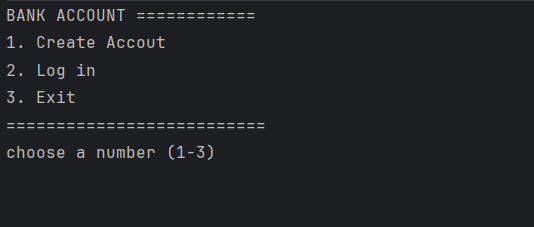
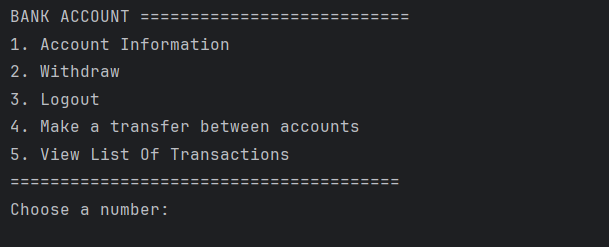
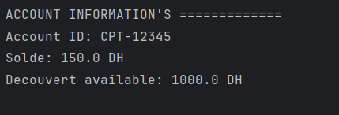
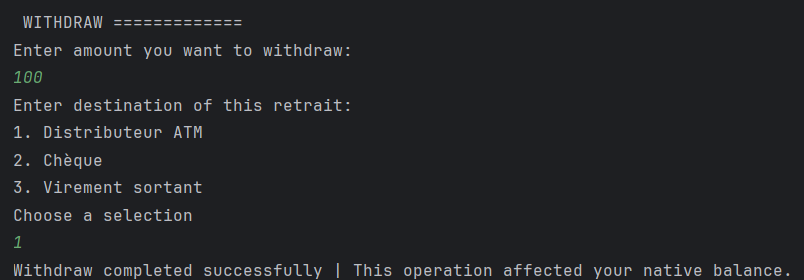

## 📖 Project Description
This project is a **console-based banking management system** developed in **Java 8**.  
The goal is to automate the management of bank accounts and their operations (deposits, withdrawals, transfers) through a structured and layered application.  

The system allows creating accounts (current or savings), managing transactions, and viewing account details and history, all while ensuring validation rules and error handling.

---

## 🛠 Technologies Used
- **Java 8**
- **Java Collections Framework** (`ArrayList`, `HashMap`)
- **Java Time API** for date management
- **Exception Handling** with `try-catch`
- **UUID** for unique identifiers in operations

---

## 📂 Project Structure
The application is organized into different layers to ensure maintainability and clarity:

1. **Presentation Layer (UI/Menu)**  
   - Interactive console-based menu for user interaction.

2. **Business Layer**  
   - Handles account and operation logic.  
   - Implements rules for withdrawals, interests, and transfers.

3. **Utility Layer**  
   - Input validation (positive amounts, account code format, etc.).  
   - Helper methods for reusability.

4. **Data Layer (in-memory)**  
   - Accounts and operations stored in `HashMap` and `ArrayList` until program termination.  

---

## 📦 Class Overview
- **`Compte` (Abstract Class)**  
  - Attributes: `code`, `solde`, `listeOperations`  
  - Abstract methods: `retirer()`, `calculerInteret()`, `afficherDetails()`  

- **`CompteCourant` (Inherits Compte)**  
  - Extra attribute: `decouvert`  
  - `calculerInteret()` always returns 0  
  - Withdrawal rule: balance must not go below `-decouvert`

- **`CompteEpargne` (Inherits Compte)**  
  - Extra attribute: `tauxInteret`  
  - `calculerInteret()` computes interest  
  - Withdrawal rule: allowed only if balance ≥ amount to withdraw  

- **`Operation` (Abstract Class)**  
  - Attributes: `numero (UUID)`, `date`, `montant`  

- **`Versement` (Inherits Operation)**  
  - Extra attribute: `source`  

- **`Retrait` (Inherits Operation)**  
  - Extra attribute: `destination`  

---

## ✅ Prerequisites
Before running the project, make sure you have:
- **Java 8 or higher** installed
- A terminal/command line interface
- (Optional) IntelliJ IDEA or Eclipse for development

---

## 🖼 Screenshots

#### REGISTRATION PAGE

#### HOME PAGE

#### ACCOUNT INFOS

#### WITHDRAW

Example placeholder:  

BANK ACCOUNT ===========================
1. Account Information"
2. Withdraw
3. Logout
4. Make a transfer between accounts
5. View List Of Transactions  
=======================================

---

## 🚀 Features
- Create Current or Savings accounts  
- Make deposits, withdrawals, and transfers  
- View account balance  
- View operations history per account  
- Input validation (positive amounts, correct account code format `CPT-XXXXX`)  
- Exception handling to avoid crashes  

---

## Class Diagrame

